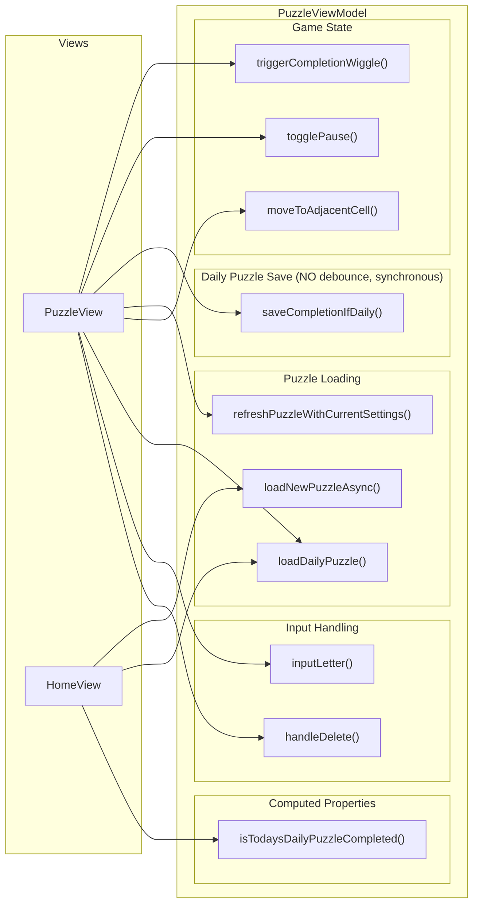

# Views to PuzzleViewModel — Call Graph

_Source: `PuzzleView.swift`, `HomeView.swift` → `PuzzleViewModel.swift`_

_Auto-generated by `tools/generate_diagrams.py` — do not edit manually._

```mermaid
flowchart LR
    subgraph Views
        PuzzleView["PuzzleView"]
        HomeView["HomeView"]
    end

    subgraph PuzzleViewModel
        subgraph vm_Computed_Properties["Computed Properties"]
            vm_isTodaysDailyPuzzleCompleted["isTodaysDailyPuzzleCompleted()"]
        end
        subgraph vm_Daily_Puzzle_Save__NO_debounce__synchronous_["Daily Puzzle Save (NO debounce, synchronous)"]
            vm_saveCompletionIfDaily["saveCompletionIfDaily()"]
        end
        subgraph vm_Game_State["Game State"]
            vm_moveToAdjacentCell["moveToAdjacentCell()"]
            vm_togglePause["togglePause()"]
            vm_triggerCompletionWiggle["triggerCompletionWiggle()"]
        end
        subgraph vm_Input_Handling["Input Handling"]
            vm_handleDelete["handleDelete()"]
            vm_inputLetter["inputLetter()"]
        end
        subgraph vm_Puzzle_Loading["Puzzle Loading"]
            vm_loadDailyPuzzle["loadDailyPuzzle()"]
            vm_loadNewPuzzleAsync["loadNewPuzzleAsync()"]
            vm_refreshPuzzleWithCurrentSettings["refreshPuzzleWithCurrentSettings()"]
        end
    end

    PuzzleView --> vm_handleDelete
    PuzzleView --> vm_inputLetter
    PuzzleView --> vm_loadDailyPuzzle
    PuzzleView --> vm_moveToAdjacentCell
    PuzzleView --> vm_refreshPuzzleWithCurrentSettings
    PuzzleView --> vm_saveCompletionIfDaily
    PuzzleView --> vm_togglePause
    PuzzleView --> vm_triggerCompletionWiggle
    HomeView --> vm_isTodaysDailyPuzzleCompleted
    HomeView --> vm_loadDailyPuzzle
    HomeView --> vm_loadNewPuzzleAsync
```
