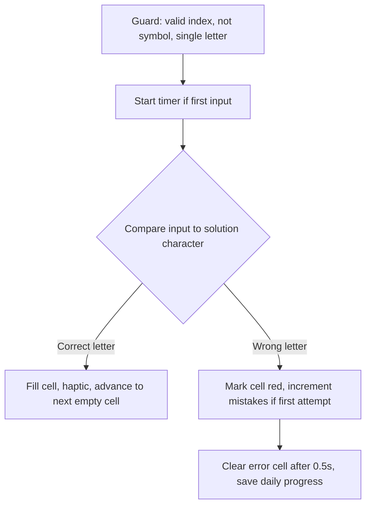

# Flow: User types a letter on the keyboard

_Source: `simple cryptogram/ViewModels/PuzzleViewModel.swift`_

_Auto-generated by `tools/generate_diagrams.py` — do not edit manually._

```mermaid
flowchart TD
    validate["Guard: valid index, not symbol, single letter"]
    start-timer["Start timer if first input"]
    check-correct{"Compare input to solution character"}
    fill-cell["Fill cell, haptic, advance to next empty cell"]
    show-error["Mark cell red, increment mistakes if first attempt"]
    clear-delay["Clear error cell after 0.5s, save daily progress"]

    validate --> start-timer
    start-timer --> check-correct
    check-correct -->|"Correct letter"| fill-cell
    check-correct -->|"Wrong letter"| show-error
    show-error --> clear-delay
```
