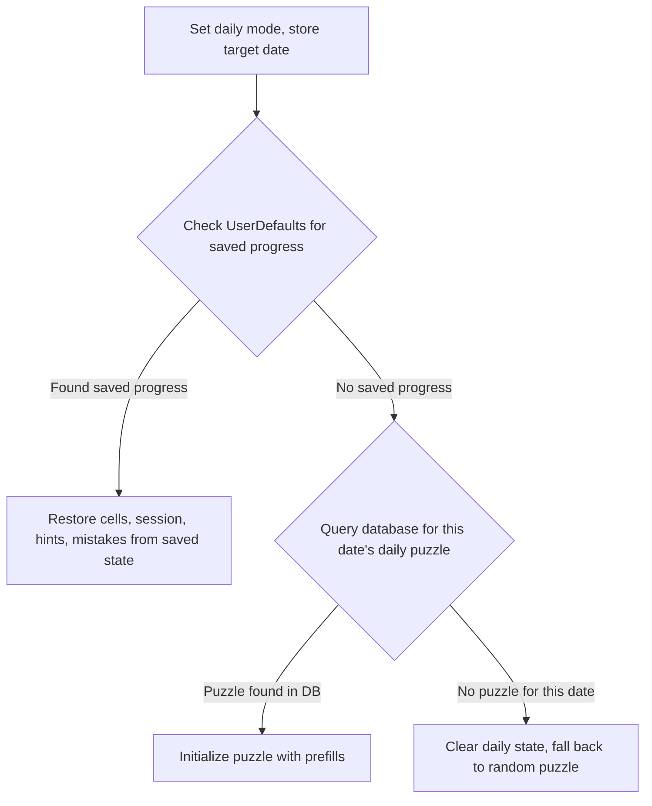

# Flow: Load daily puzzle for a given date

_Source: `simple cryptogram/ViewModels/PuzzleViewModel.swift`_

_Auto-generated by `tools/generate_diagrams.py` — do not edit manually._

```mermaid
flowchart TD
    set-daily["Set daily mode, store target date"]
    check-saved{"Check UserDefaults for saved progress"}
    restore["Restore cells, session, hints, mistakes from saved state"]
    fetch-fresh{"Query database for this date's daily puzzle"}
    fallback["Clear daily state, fall back to random puzzle"]
    start-fresh["Initialize puzzle with prefills"]

    set-daily --> check-saved
    check-saved -->|"Found saved progress"| restore
    check-saved -->|"No saved progress"| fetch-fresh
    fetch-fresh -->|"Puzzle found in DB"| start-fresh
    fetch-fresh -->|"No puzzle for this date"| fallback
```
