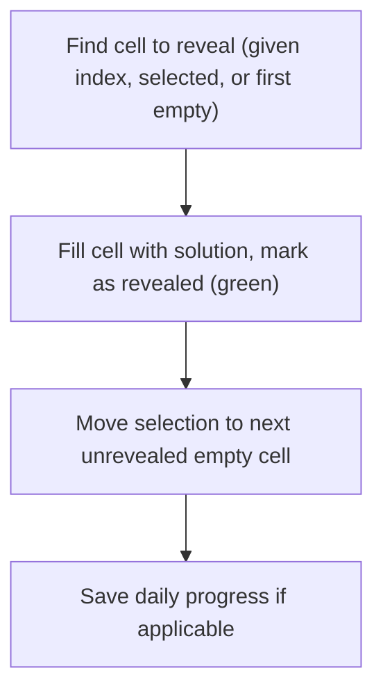

# Flow: User requests a hint to reveal a cell

_Source: `simple cryptogram/ViewModels/PuzzleViewModel.swift`_

_Auto-generated by `tools/generate_diagrams.py` — do not edit manually._

```mermaid
flowchart TD
    find-target["Find cell to reveal (given index, selected, or first empty)"]
    reveal["Fill cell with solution, mark as revealed (green)"]
    advance["Move selection to next unrevealed empty cell"]
    save-hint["Save daily progress if applicable"]

    find-target --> reveal
    reveal --> advance
    advance --> save-hint
```
