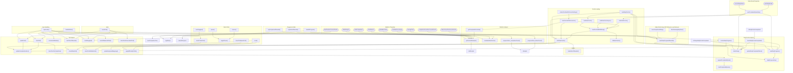

# PuzzleViewModel — Internal Call Graph

_Source: `simple cryptogram/ViewModels/PuzzleViewModel.swift`_

_Auto-generated by `tools/generate_diagrams.py` — do not edit manually._

```mermaid
flowchart TD
    subgraph Author["Author"]
        loadAuthorIfNeeded["loadAuthorIfNeeded()"]
    end
    subgraph Statistics_Properties["Statistics Properties"]
        completionCountForCurrentPuzzle([completionCountForCurrentPuzzle])
        failureCountForCurrentPuzzle([failureCountForCurrentPuzzle])
        bestTimeForCurrentPuzzle([bestTimeForCurrentPuzzle])
        totalAttempts([totalAttempts])
        totalCompletions([totalCompletions])
        totalFailures([totalFailures])
        globalBestTime([globalBestTime])
        winRatePercentage([winRatePercentage])
        averageTime([averageTime])
    end
    subgraph Daily_Streak_Properties["Daily Streak Properties"]
        currentDailyStreak([currentDailyStreak])
        bestDailyStreak([bestDailyStreak])
        wasCompletedSameDay["wasCompletedSameDay()"]
    end
    subgraph Puzzle_Loading["Puzzle Loading"]
        startNewPuzzle["startNewPuzzle()"]
        loadNewPuzzle["loadNewPuzzle()"]
        loadNewPuzzleAsync["loadNewPuzzleAsync()"]
        refreshPuzzleWithCurrentSettings["refreshPuzzleWithCurrentSettings()"]
        loadDailyPuzzle["loadDailyPuzzle()"]
        loadInitialPuzzle["loadInitialPuzzle()"]
        loadPuzzleWithExclusions["loadPuzzleWithExclusions()"]
        loadPuzzleWithDifficulty["loadPuzzleWithDifficulty()"]
        fallbackPuzzle["fallbackPuzzle()"]
    end
    subgraph Input_Handling["Input Handling"]
        inputLetter["inputLetter()"]
        handleDelete["handleDelete()"]
    end
    subgraph Hints["Hints"]
        revealCell["revealCell()"]
    end
    subgraph Game_State["Game State"]
        reset["reset()"]
        togglePause["togglePause()"]
        pause["pause()"]
        resume["resume()"]
        userEngaged["userEngaged()"]
        moveToNextCell["moveToNextCell()"]
        moveToAdjacentCell["moveToAdjacentCell()"]
    end
    subgraph Daily_Puzzle_Save__NO_debounce__synchronous_["Daily Puzzle Save (NO debounce, synchronous)"]
        saveDailyProgressIfNeeded["saveDailyProgressIfNeeded()"]
        saveCompletionIfDaily["saveCompletionIfDaily()"]
        flushPendingDailySave["flushPendingDailySave()"]
    end
    subgraph Progress___Stats["Progress & Stats"]
        logCompletionIfNeeded["logCompletionIfNeeded()"]
        logFailureIfNeeded["logFailureIfNeeded()"]
        resetAllProgress["resetAllProgress()"]
    end
    subgraph Cell_Helpers["Cell Helpers"]
        updateCell["updateCell()"]
        clearCell["clearCell()"]
        updateCompletedLetters["updateCompletedLetters()"]
        checkPuzzleCompletion["checkPuzzleCompletion()"]
        incrementMistakes["incrementMistakes()"]
        startTimerIfNeeded["startTimerIfNeeded()"]
        markEngaged["markEngaged()"]
        resetAllWasJustFilled["resetAllWasJustFilled()"]
        shouldSkipCell["shouldSkipCell()"]
        selectFirstEditableCell["selectFirstEditableCell()"]
        selectNextUnrevealedCell["selectNextUnrevealedCell()"]
        updateKeyboardMappings["updateKeyboardMappings()"]
        applyDifficultyPrefills["applyDifficultyPrefills()"]
    end
    subgraph Daily_Puzzle_Helpers["Daily Puzzle Helpers"]
        checkDailyPuzzleCompleted["checkDailyPuzzleCompleted()"]
        restoreDailyProgress["restoreDailyProgress()"]
        readDailyProgress["readDailyProgress()"]
        appendCompletedQuote["appendCompletedQuote()"]
        loadCompletedQuotes["loadCompletedQuotes()"]
        dailyProgressKey["dailyProgressKey()"]
        dateString["dateString()"]
        updateDailyCompletedStatus["updateDailyCompletedStatus()"]
    end
    subgraph Statistics_Helpers["Statistics Helpers"]
        getCachedAttempts["getCachedAttempts()"]
        invalidateStatsCache["invalidateStatsCache()"]
        progressStore_completionCount["progressStore_completionCount()"]
        progressStore_failureCount["progressStore_failureCount()"]
        getCompletedPuzzleIds["getCompletedPuzzleIds()"]
    end

    isDailyPuzzleCompleted --> checkDailyPuzzleCompleted
    isTodaysDailyPuzzleCompleted --> dateString
    isTodaysDailyPuzzleCompleted --> readDailyProgress
    completionCountForCurrentPuzzle --> progressStore_completionCount
    failureCountForCurrentPuzzle --> progressStore_failureCount
    bestTimeForCurrentPuzzle --> bestCompletionTime
    totalAttempts --> getCachedAttempts
    totalCompletions --> getCachedAttempts
    totalFailures --> getCachedAttempts
    globalBestTime --> getCachedAttempts
    winRatePercentage --> getCachedAttempts
    averageTime --> getCachedAttempts
    currentDailyStreak --> wasCompletedSameDay
    bestDailyStreak --> wasCompletedSameDay
    wasCompletedSameDay --> dateString
    wasCompletedSameDay --> readDailyProgress
    wasCompletedSameDay --> startNewPuzzle
    wasCompletedSameDay --> loadInitialPuzzle
    startNewPuzzle --> updateKeyboardMappings
    startNewPuzzle --> applyDifficultyPrefills
    startNewPuzzle --> selectFirstEditableCell
    startNewPuzzle --> loadAuthorIfNeeded
    loadNewPuzzle --> loadPuzzleWithDifficulty
    loadNewPuzzleAsync --> loadPuzzleWithDifficulty
    refreshPuzzleWithCurrentSettings --> loadPuzzleWithExclusions
    loadDailyPuzzle --> dateString
    loadDailyPuzzle --> readDailyProgress
    loadDailyPuzzle --> startNewPuzzle
    loadDailyPuzzle --> restoreDailyProgress
    loadDailyPuzzle --> loadNewPuzzle
    loadInitialPuzzle --> loadPuzzleWithDifficulty
    loadPuzzleWithExclusions --> getCompletedPuzzleIds
    loadPuzzleWithExclusions --> startNewPuzzle
    loadPuzzleWithExclusions --> loadPuzzleWithDifficulty
    loadPuzzleWithDifficulty --> startNewPuzzle
    loadPuzzleWithDifficulty --> fallbackPuzzle
    inputLetter --> startTimerIfNeeded
    inputLetter --> resetAllWasJustFilled
    inputLetter --> updateCell
    inputLetter --> moveToNextCell
    inputLetter --> markEngaged
    inputLetter --> saveDailyProgressIfNeeded
    inputLetter --> incrementMistakes
    inputLetter --> clearCell
    handleDelete --> clearCell
    handleDelete --> markEngaged
    handleDelete --> saveDailyProgressIfNeeded
    revealCell --> startTimerIfNeeded
    revealCell --> updateCell
    revealCell --> selectNextUnrevealedCell
    revealCell --> markEngaged
    revealCell --> saveDailyProgressIfNeeded
    reset --> applyDifficultyPrefills
    reset --> updateCompletedLetters
    reset --> selectFirstEditableCell
    pause --> togglePause
    resume --> togglePause
    userEngaged --> markEngaged
    moveToNextCell --> shouldSkipCell
    moveToAdjacentCell --> shouldSkipCell
    saveDailyProgressIfNeeded --> dateString
    saveDailyProgressIfNeeded --> dailyProgressKey
    saveCompletionIfDaily --> saveDailyProgressIfNeeded
    flushPendingDailySave --> saveDailyProgressIfNeeded
    logCompletionIfNeeded --> logAttempt
    logCompletionIfNeeded --> invalidateStatsCache
    logFailureIfNeeded --> logAttempt
    logFailureIfNeeded --> invalidateStatsCache
    resetAllProgress --> clearAllProgress
    resetAllProgress --> invalidateStatsCache
    updateCell --> updateCompletedLetters
    updateCell --> checkPuzzleCompletion
    clearCell --> updateCompletedLetters
    checkPuzzleCompletion --> appendCompletedQuote
    checkDailyPuzzleCompleted --> updateDailyCompletedStatus
    checkDailyPuzzleCompleted --> dateString
    checkDailyPuzzleCompleted --> readDailyProgress
    restoreDailyProgress --> updateCompletedLetters
    readDailyProgress --> dailyProgressKey
    appendCompletedQuote --> loadCompletedQuotes
    getCachedAttempts --> allAttempts
    progressStore_completionCount --> attempts
    progressStore_failureCount --> attempts
    getCompletedPuzzleIds --> getCachedAttempts
```
